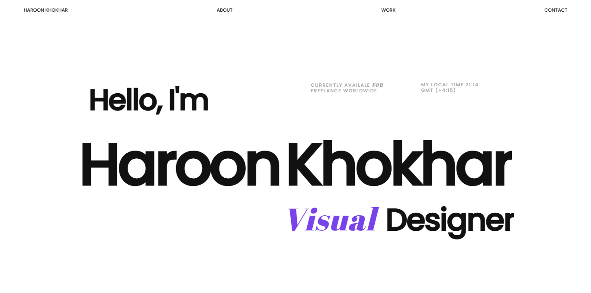

# 🚀 Modern Animated Portfolio Website

A sleek, performance-optimized, and interactive personal portfolio built using **GSAP**, **Three.js**, **Locomotive Scroll**, **HTML**, **CSS**, and **JavaScript**.

## 🎯 Features

- ✨ Smooth animations using GSAP
- 🌀 Interactive 3D effects powered by Three.js
- 🎯 Scroll-based transitions with Locomotive Scroll
- ⚡ Optimized for performance and responsiveness
- 📱 Fully responsive design for all devices
- 🎨 Modern UI with minimal aesthetic

## 🛠️ Tech Stack

- **HTML5** – Markup structure  
- **CSS3** – Custom styling  
- **JavaScript (ES6+)** – Functionality and animations  
- **GSAP** – Smooth timeline and scroll animations  
- **Three.js** – 3D animations and transitions  
- **Locomotive Scroll** – Smooth scrolling and scroll-based effects


## 📸 Preview




📬 Contact
Have feedback or want to collaborate?

📧 Email: haroonriaz6565@gmail.com
🌐 Portfolio: https://haroonkhokhar-me.netlify.app/

⭐ Star this repo if you found it useful!

Let me know if you'd like it tailored with your name, portfolio URL, or GitHub repo link.


## 🔧 Installation

```bash
# Clone the repository
git clone https://github.com/yourusername/animated-portfolio.git

# Navigate into the folder
cd portfolio

# Open index.html in browser

